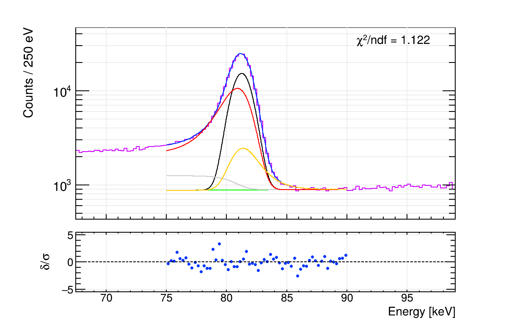
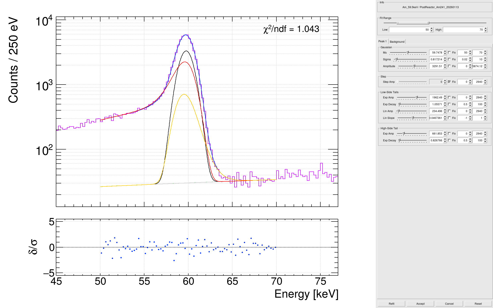
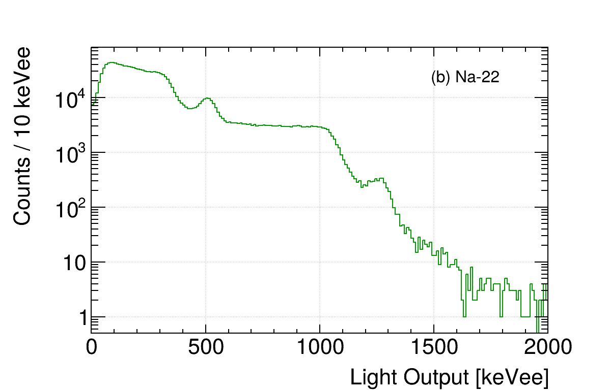

# Analysis-Utilities
<!---->
C++ utilities for analysis of nuclear measurement data, built on [ROOT](https://root.cern/), with a focus on ergonomics and performance.
Supports CAEN digitizers via CoMPASS and WaveDump acquisition software.
The RooFit-based photopeak fitting backend includes CUDA kernels for its custom PDFs and dispatches `doEval` to the GPU when the library is built with CUDA support — see [GPU acceleration](#fittingutils-and-roofitutils) for details and measured speedups.
The flake also exposes a Python package, with a wrapper around the PlottingUtils as well as a method for efficiently loading TTrees into Python native data types (numpy array, pandas df) so that machine learning libraries in Python can be used.
Warning: Currently in active development; breaking changes are all but guaranteed...
<!---->
## Installation
<!---->
### Prerequisites
<!---->
This project uses [Nix](https://nixos.org/) to manage dependencies.
Install it by following the instructions [here](https://nixos.org/download/).
Ensure [flakes are enabled](https://nixos.wiki/wiki/Flakes#Enable_flakes_permanently) in your Nix configuration.
<!---->
### Setup
<!---->
In a new project directory:
<!---->
```bash
# C++ template (default) — ROOT + compiled libraries
nix flake init -t github:ewtodd/Analysis-Utilities --refresh
nix develop
```
<!---->
This creates a development environment with access to the libraries.
Compile local code with the included Makefile and run macros with `root -l macro.cpp+`.
<!---->
```bash
# Python template — includes analysis-utilities Python package and ML libraries
nix flake init -t github:ewtodd/Analysis-Utilities#python --refresh
nix develop
```
<!---->
## Modules
<!---->
### BinaryUtils
<!---->
Read binary data files from CAEN acquisition software.
<!---->
**CoMPASSReader** - Reads CoMPASS binary files (`.bin`):
- Parses event headers, timestamps, energy values, and waveforms
- Supports all CoMPASS waveform codes (INPUT, RC_CR, TRAPEZOID, CFD, etc.)
- Decodes status flags (pileup, saturation, deadtime, trigger lost, etc.)
<!---->
**WaveDump742Reader** - Reads WaveDump binary files for DT5742 family digitizers:
- Parses event structure including DC offset and start index cell
- Optional timing corrections support
<!---->
### WaveformProcessingUtils
<!---->
Process raw waveforms and extract physical parameters.
<!---->
- **Baseline subtraction** - Configurable number of pre-trigger samples
- **Trigger finding** - Fraction-of-peak threshold with configurable polarity
- **Waveform cropping** - Extract region of interest around trigger
- **Feature extraction** - Pulse height, peak position, short/long integrals, PSD ratio
- **Quality cuts** - Reject clipped signals, baseline issues, negative integrals
- **Parallel file processing** - Process multiple files concurrently using `std::async` with configurable worker count (defaults to 4).
Files are dispatched in batches, with each worker getting its own `WaveformProcessingUtils` instance.
Requires ROOT thread safety (`ROOT::EnableThreadSafety()`), which is handled automatically.
<!---->
Outputs processed data to ROOT TTrees with optional waveform storage.
<!---->
### FittingUtils and RooFitUtils
<!---->
Fit gamma-ray spectral photopeaks with a composable model.
Two backends are provided with identical APIs and result types so call sites can swap one for the other:
<!---->
- **`FittingUtils`** - `TF1` + ROOT::Math::Minimizer (Minuit2), binned chi-squared.
Fast, pointwise un-normalized model evaluation.
- **`RooFitUtils`** - `RooAddPdf` of custom `RooAbsPdf` components, **unbinned extended maximum likelihood**.
The custom PDFs (`RooStepShelf`, `RooLowExpTail`, `RooLowLinTail`, `RooHighExpTail`) implement `doEval()` so every NLL pass is vectorized over events rather than dispatching scalar `evaluate()` calls per event.
The CPU `doEval` paths are OpenMP-parallelized; when built with CUDA support (see the **GPU acceleration** subsection below), each PDF also includes a  `__global__` kernel under `gpu/` and `doEval` dispatches to the kernel when RooFit hands it device-resident buffers.
Each component PDF still re-normalizes numerically over the fit range per Minuit step, but the per-step cost is amortized.
Provides RooFit's full machinery for downstream extensions (e.g. simultaneous fits).
<!---->
Both classes take the same constructor signature, expose the same `Set*` flag setters, and return the same `FitResult` struct.
The interactive fit editor is implemented per-backend (`InteractiveFitEditor` for TF1, `InteractiveRooFitEditor` for RooFit, and `InteractiveSimultaneousFitEditor` for multi-channel simultaneous RooFit fits).
Saved-parameter files use the `.fits` extension for the TF1 backend and `.roofits` for the RooFit backend, so the two can coexist for the same input.
<!---->
**Base model**:
- Gaussian peak + linear or flat background
<!---->
**Optional components** (individually togglable, for semiconductor detectors with segmented electrodes):
- **Step function** - Models events where part of the photon energy escapes the active volume, producing a step-like distribution on the left side of the peak, smeared by the detector resolution.
- **Low-energy exponential tail** - Exponential tail below the photopeak from incomplete charge collection, charge trapping, etc.
- **Low-energy linear tail** - Linear tail component that can capture asymmetric tailing not well described by a single exponential.
- **High-energy exponential tail** - Exponential tail above the photopeak from pileup effects.
<!---->
Components are tested using a hybrid group-and-prune approach: low-side components (step + both low-energy tails) are enabled as a group, then individually pruned if they do not improve the fit.
The high-energy tail is tested independently.
A component is kept only if it improves the reduced chi-squared.
<!---->
**Multi-peak fitting**:
- Double and triple peak variants with all components enabled by default
- Constrained fitting using results from previous fits
<!---->
All fits produce structured results (`FitResult` containing `PeakFitResult` entries) with parameter values, errors, and reduced chi-squared.
Failed fits return -1 for all parameters.
Reduced chi-squared is displayed on fit plots by default.
Individual peak components are plotted summed with the background for readability, and multi-peak fits use distinct line styles per peak.
<!---->
**Backend-specific notes for `RooFitUtils`**:
- Input is an event-level `std::vector<Double_t>` plus a display bin width (used only for plotting and the post-hoc reduced chi-squared used for component pruning).
A static `LoadEventsFromTree` helper extracts events from a ROOT `TTree` branch.
The fit itself never bins.
- Amplitude/yield semantics: gaussian, step and tail "amplitude" fields in `PeakFitResult` carry RooFit yields (event counts) rather than peak heights.
This is internally consistent for constrained fits because the ratio `component_amplitude / gaus_amplitude` is the same quantity in both backends.
- The low-energy linear tail factor `(1 + s·(x-μ))` is floored at zero to keep the PDF non-negative as required by RooFit normalization. The TF1 backend has no such constraint.
- `RooRealVar::enableSilentClipping()` is enabled so observable values outside the current range are silently clipped rather than throwing.
- **CPU vs CUDA backend**: by default `fitTo()` calls dispatch through `RooFit::EvalBackend::Cpu()`, and the OpenMP-parallelized `doEval` path handles batched evaluation. When compiled with `-DAU_ROOFIT_BACKEND_CUDA=1`, `BestAvailableBackend()` (in `RooFitUtils.hpp`) returns `RooFit::EvalBackend::Cuda()` instead, and all four custom PDFs report `canComputeBatchWithCuda() = true` and dispatch to CUDA kernels. See the **GPU acceleration** subsection below for the nix-flake opt-in.
<!---->

<!---->
**Interactive fitting**:
- `SetInteractive()` enables a GUI editor that opens after the automated fit completes.
The editor shows the histogram, total fit, and individual components with a residual (pull) panel marked by dashed ±3σ guide lines, all updating in real-time as parameters are adjusted via sliders and number entries.
A fit range slider allows adjusting the fit range visually; for the RooFit backend the display histogram is rebuilt from the underlying events whenever the range changes, so binning follows the zoom in real time (the fit itself remains unbinned).
Parameters can be fixed/freed via checkboxes, and a Refit button runs the underlying minimizer with the current values as initial guesses.
Live chi-squared is displayed on the plot.
<!---->

<!---->
- On accept, parameters and fit range are saved to a `.fits` (TF1) or `.roofits` (RooFit) file in the `plots/fits/` directory.
On subsequent runs with `SetInteractive()`, saved parameters are loaded automatically and the editor is skipped, so interactive results only need to be produced once.
Delete the saved file to redo the interactive fit.
- It is recommended to re-run the fitting macro after an interactive session, as the saved parameters serve as much better starting points for the minimizer and often produce a lower chi-squared on the second pass.
- Batch mode is temporarily disabled for the editor window and restored afterward, so plot popups are not affected.
<!---->
**Simultaneous multi-channel fits (`RooFitUtils`)**:
<!---->
Construct a `RooFitUtils` with the default constructor to put it in simultaneous mode, then register channels and run one joint extended-likelihood fit across all of them.
A channel is one spectrum (its own events, fit range, peaks, and background) sharing a single observable with the others.
<!---->
- **`AddChannel(name, events, fit_range_low, fit_range_high, display_bin_width_kev, num_peaks, mu_inits, ...)`** - adds a channel.
The component flags (`use_flat_background`, `use_step`, `use_low_exp_tail`, `use_low_lin_tail`, `use_high_exp_tail`) match the single-channel model, plus per-channel locking options described below.
- **`LinkParameter(target, source)`** / **`LinkPeakShape(target_channel, target_peak, source_channel, source_peak)`** - tie a parameter (or a peak's whole shape) in one channel to another so they are fit as a single shared degree of freedom.
- **`SeedChannel(channel_name, result)`** - supply a prior single-channel `FitResult` as starting values for that channel.
- **`FitSimultaneous(input_name, base_label)`** - builds the `RooSimultaneous`, applies the locks, and returns one `FitResult` per channel. With `SetInteractive()` the simultaneous editor opens after the automated fit, and accepted parameters are saved/reloaded as for the single-channel editors.
<!---->
Per-channel locking options on `AddChannel` (all optional):
- **`mu_fixed`** - per-peak `std::vector<Bool_t>`; where `kTRUE`, that peak's centroid is held at its `mu_inits` value instead of floating.
- **`bkg_yield_fixed`** / **`bkg_slope_fixed`** - hold the channel's background yield and/or slope constant.
- **`lock_shape_after_seed`** - after seeding, fix sigma, the gaussian yield, and every tail/step shape parameter so only peak positions and normalizations float.
- **`use_step_per_peak`** - per-peak `std::vector<Bool_t>` overriding the channel-level `use_step` for individual peaks (e.g. a step on some peaks but not on another peak sharing the channel).
<!---->
**GPU acceleration (opt-in)**:
<!---->
The flake exposes two library variants:
<!---->
- `packages.default` — CPU build. `doEval()` runs an OpenMP-parallelized loop on the host; backend dispatches through `RooFit::EvalBackend::Cpu()`.
- `packages.cuda` — CUDA build. Each custom PDF ships a `__global__` kernel under `gpu/`; `doEval()` queries the output buffer with `cudaPointerGetAttributes` and, when RooFit hands it device memory, launches the kernel instead of running the host loop. Backend dispatches through `RooFit::EvalBackend::Cuda()`. Built against a `-Dcuda=ON` override of ROOT (re-exposed as `packages.rootCuda` so downstream consumers don't have to duplicate the override).
<!---->
Build details: the project is CMake-based.
The CUDA build sets `-DAU_USE_CUDA=ON`, which enables CUDA as a CMake language, picks up `gpu/*.cu` alongside `src/*.cpp`, defines `AU_ROOFIT_BACKEND_CUDA=1` for the host code, and links `CUDA::cudart`.
The CPU build never compiles the kernel files and never touches the CUDA toolchain.
<!---->
A downstream flake opts in by swapping `default` → `cuda` and `pkgs.root` → `utils.packages.${system}.rootCuda`, and exporting the matching compile-define so downstream code that calls `BestAvailableBackend()` agrees with the prebuilt library:
<!---->
```nix
analysis-utils = utils.packages.${system}.cuda;
root           = utils.packages.${system}.rootCuda;
# ...
shellHook = ''
  export NIX_CFLAGS_COMPILE="-DAU_ROOFIT_BACKEND_CUDA=1''${NIX_CFLAGS_COMPILE:+ $NIX_CFLAGS_COMPILE}"
  export LD_LIBRARY_PATH="/run/opengl-driver/lib''${LD_LIBRARY_PATH:+:$LD_LIBRARY_PATH}"
'';
```
<!---->
The `LD_LIBRARY_PATH` line ensures nix-built binaries find the host's `libcuda.so` (NixOS exposes it under `/run/opengl-driver/lib`) rather than a stub from the nix store.
<!---->
**Performance, measured.** On a 4 M-event unbinned extended maximum-likelihood fit (73mGe calibration workload, RTX 50-series GPU):
<!---->
| Path | Single fit | Simultaneous fit |
|------|-----------:|-----------------:|
| Scalar `evaluate()` (legacy) | ~minutes | ~minutes |
| OpenMP batched `doEval` | ~2 min | ~3 min |
| CUDA kernels (`packages.cuda`) | ~6 s | ~36 s |
<!---->
The CUDA win for simultaneous fits is smaller than for single fits because once `doEval` is effectively free, the remaining time is dominated by Minuit2 itself, the analytic normalization integrals (computed on the host per-step), and RooFit's evaluator orchestration — none of which benefit from GPU work.
<!---->
The `cudaCapabilities` list in the flake's `pkgs = import nixpkgs { config = { ... }; }` block defaults to `[ "12.0" ]` (Blackwell / RTX 50-series). Adjust to your GPU's compute capability and update `-DCMAKE_CUDA_ARCHITECTURES` in the `rootWithCuda` overlay to match.
<!---->
**Do not override the `nixpkgs` input** (e.g. via `inputs.utils.inputs.nixpkgs.follows`).
The CUDA-built ROOT is large and would otherwise be rebuilt from source against your nixpkgs revision.
Leaving the input alone lets your machine pull the pre-built artifact from the binary cache (see [Binary Cache](#binary-cache) below) instead.
<!---->
**References**:
- Boggs SE, Pike SN.
Analytical fitting of gamma-ray photopeaks in germanium cross strip detectors.
*Experimental Astronomy*.
2023;56(2-3):403-420.
doi: [10.1007/s10686-023-09914-8](https://doi.org/10.1007/s10686-023-09914-8).
- Longoria LC, Naboulsi AH, Gray PW, MacMahon TD.
Analytical peak fitting for gamma-ray spectrum analysis with Ge detectors.
*Nuclear Instruments and Methods in Physics Research A*.
1990;299(1-3):308-312.
doi: [10.1016/0168-9002(90)90797-A](https://doi.org/10.1016/0168-9002(90)90797-A).
<!---->
### PlottingUtils
<!---->

All-static utility class for publication quality ROOT graphics with consistent styling.
No object instantiation required.
<!---->
**Initialization**:
- `SetStylePreferences(PlotSaveFormat)` - Must be called before using other methods (warns if not).
Sets global ROOT style and chooses output format (`PlotSaveFormat::kPNG` or `PlotSaveFormat::kPDF`, defaults to PNG).
Calling `InitUtils::SetROOTPreferences()` takes care of this and is recommended.
<!---->
**Canvas**:
- `GetConfiguredCanvas(Bool_t logy)` - Returns a pre-configured 1200x800 `TCanvas` with grid and tick marks
<!---->
**Object configuration**:
- `ConfigureGraph` / `ConfigureAndDrawGraph` - Set line color/width, axis label/title sizes, and offsets on a `TGraph`
- `ConfigureHistogram` / `ConfigureAndDrawHistogram` - Same for `TH1`, plus fill style and axis division settings
- `Configure2DHistogram` / `ConfigureAndDraw2DHistogram` - Same for `TH2`, enables log-z and adjusts right margin for color axis
<!---->
**Annotations**:
- `AddLegend(x1, x2, y1, y2)` - Returns a drawn `TLegend` with consistent font/border styling.
Note: argument order is the extremely sane `(x1, x2, y1, y2)`, not the ROOT default `(x1, y1, x2, y2)`.
- `AddText(label, x, y, angle)` - Returns a drawn `TLatex` in NDC coordinates for arbitrary annotations (e.g. subplot labels like "(a)", "(b)", or any other text).
Optional `angle` (default 0) sets text rotation in degrees.
<!---->
**Output**:
- `SaveFigure(canvas, name, subdirectory, PlotSaveOptions)` - Saves to `<plots_base>/` (or `<plots_base>/<subdirectory>/` if specified) using the format set in `SetStylePreferences`.
The base defaults to `"plots"` (CWD-relative) and is configurable via `SetPlotsBaseDir` or `InitUtils::SetROOTPreferences`.
Parent directories are created automatically.
`PlotSaveOptions` controls linear (`kLINEAR`), log (`kLOG`), or both (`kBOTH`, default).
Log variants are prefixed with `log_`.
- `SetPlotsBaseDir(dir)` / `GetPlotsBaseDir()` - Set/inspect the plot output base directory.
Trailing slashes are stripped on set.
Pass an absolute path so output is anchored to a project root regardless of CWD.
<!---->
**Utilities**:
- `GetDefaultColors()` - Returns a 24-color palette of distinct ROOT colors
- `GetRandomName()` - Generates a random canvas name to avoid ROOT name collisions
<!---->
### InitUtils
<!---->
Initialization and file conversion utilities.
<!---->
- `SetROOTPreferences(save_format, plots_dir, root_files_dir)` - Configure ROOT environment, set the plot output base via `PlottingUtils::SetPlotsBaseDir`, and set the ROOT-files I/O base via `IO::SetRootFilesBaseDir`.
Pass absolute paths so output is anchored to a project root regardless of CWD.
If `plots_dir` or `root_files_dir` is omitted, a warning is printed and the CWD-relative defaults `"plots"` / `"root_files"` are used.
- `ConvertCoMPASSBinToROOT()` - Convert CoMPASS binary files to ROOT format
<!---->
### IOUtils
<!---->
Path-aware ROOT file open helpers.
Subpaths resolve against the base directory configured via `IO::SetRootFilesBaseDir` (or `InitUtils::SetROOTPreferences`); absolute paths pass through untouched.
All filesystem operations use `gSystem` (no `std::filesystem`).
<!---->
- `IO::SetRootFilesBaseDir(dir)` - Set the base directory (default `"root_files"`).
Trailing slashes are stripped.
- `IO::GetRootFilesBaseDir()` - Return the current base directory.
- `IO::OpenForReading(subpath)` - Returns a `TFile*` opened in `"READ"` at `<base>/<subpath>` (or just `subpath` if absolute).
- `IO::OpenForWriting(subpath, mode = "RECREATE")` - Same join semantics, plus creates parent directories via `gSystem->mkdir(..., kTRUE)` before opening.
<!---->
## Python Package
<!---->
The `analysis-utilities` Python package provides two things: a bridge to use PlottingUtils from Python scripts, and a loader for efficiently reading ROOT TTrees into numpy arrays and pandas DataFrames for use with machine learning libraries.
<!---->
### Setup
<!---->
To use the Python package in a downstream project, add the `pythonPackage` output to your flake and include it in a Python environment:
<!---->
```nix
# In your project's flake.nix
let
  pkgs = nixpkgs.legacyPackages.${system};
  analysis-utils = utils.packages.${system}.default;
  analysis-utilities-py = utils.packages.${system}.pythonPackage;
in
{
  devShells.default = pkgs.mkShell {
    buildInputs = [
      analysis-utils
      (pkgs.python3.withPackages (ps: [
        analysis-utilities-py
        ps.numpy
        ps.pandas
        # add ML libraries here, e.g. ps.scikit-learn
      ]))
      pkgs.root
    ];
    shellHook = ''
      export LD_LIBRARY_PATH="${analysis-utils}/lib''${LD_LIBRARY_PATH:+:$LD_LIBRARY_PATH}"
      export ROOT_INCLUDE_PATH="${analysis-utils}/include''${ROOT_INCLUDE_PATH:+:$ROOT_INCLUDE_PATH}"
    '';
  };
}
```
<!---->
### PlottingUtils bridge
<!---->
`load_cpp_library()` loads the C++ shared library into ROOT and declares the PlottingUtils header, making the full PlottingUtils API available through PyROOT:
<!---->
```python
from analysis_utilities import load_cpp_library
#
ROOT = load_cpp_library()
#
ROOT.PlottingUtils.SetStylePreferences(ROOT.PlotSaveFormat.kPNG)
c = ROOT.PlottingUtils.GetConfiguredCanvas(False)
# Use ROOT.PlottingUtils.ConfigureGraph, ConfigureHistogram, etc.
```
<!---->
### Project-rooted output paths
<!---->
`set_root_preferences` configures the ROOT environment and pins both the plot output base and the ROOT-files I/O base to absolute paths, so downstream scripts produce identical output regardless of CWD.
The same call wires `PlottingUtils::SaveFigure` and `IO::OpenForReading` / `IO::OpenForWriting` (Python: `analysis_utilities.io.open_for_reading` / `open_for_writing`) to the configured locations on both the Python and C++ sides.
<!---->
```python
from pathlib import Path
from analysis_utilities import (set_root_preferences, open_for_reading,
                                  open_for_writing)
#
PROJECT_ROOT = Path(__file__).resolve().parent.parent
ROOT = set_root_preferences(plots_dir=PROJECT_ROOT / "plots" / "raw",
                            root_files_dir=PROJECT_ROOT / "root_files")
#
# Read: opens <root_files_base>/<subpath>
fin = open_for_reading(f"filtered/run42.root")
#
# Write: creates parent dirs under <root_files_base> before opening
fout = open_for_writing(f"raw/calibration_2026-05-01.root")          # default RECREATE
fupd = open_for_writing(f"filtered/run42.root", mode="UPDATE")
#
# Absolute subpaths bypass the base entirely.
```
<!---->
Omitting `plots_dir` or `root_files_dir` prints a warning and falls back to the CWD-relative defaults (`"plots"` and `"root_files"`).
The IO helpers use only `ROOT.gSystem` for filesystem operations (path joining via `ConcatFileName`, parent creation via `mkdir`); no `pathlib` is imported on the open code path.
<!---->
### TTree loader
<!---->
`load_tree_data()` reads ROOT TTrees into pandas DataFrames and numpy arrays.
It handles type detection, TChain construction for multiple files, and optional waveform array branches.
Results are automatically cached to disk (as pickle/npy files) so that subsequent loads skip the ROOT I/O entirely.
The cache is invalidated when any source ROOT file is newer than the cached file.
<!---->
```python
from analysis_utilities.io import load_tree_data
#
# Load scalar branches into a DataFrame (cached to df_cache/ by default)
df = load_tree_data("output.root", tree_name="features")
#
# Load from multiple files with event limit
df = load_tree_data(
    ["run1.root", "run2.root"],
    tree_name="features",
    max_events=50000,
)
#
# Load waveforms alongside scalar data
df, waveforms = load_tree_data(
    "output.root",
    tree_name="features",
    array_branch="waveform",
)
# waveforms is a 2-D numpy array with shape (n_events, n_samples)
#
# Disable caching
df = load_tree_data("output.root", cache_dir=None)
```
<!---->
**Parameters**:
- `root_files` - Path or list of paths to ROOT files (combined via TChain)
- `tree_name` - TTree name (default: `"features"`)
- `scalar_branches` - Branch names to load, or `None` to auto-detect all scalar branches. Caching requires `None` (all branches); pass `cache_dir=None` if you need a subset.
- `array_branch` - Name of a `TArrayF`/`TArrayS` branch to load as a 2-D numpy array
- `max_events` - Cap on number of events to read
- `cache_dir` - Directory for cached files (default: `"df_cache"`). Set to `None` to disable caching.
<!---->
**Returns** a `pandas.DataFrame` of scalar data. If `array_branch` is specified, returns a tuple of `(DataFrame, numpy.ndarray)`.
<!---->
Supported branch types: `Float_t`, `Double_t`, `Int_t`, `UInt_t`, `Short_t`, `UShort_t`, `Long64_t`, `ULong64_t`, `UChar_t`.
<!---->
## Binary Cache
<!---->
The CUDA-overlaid ROOT and the `packages.cuda` library are large to build from source. **e-desktop** (the primary development host for this project) re-serves its nix store as a binary cache so other machines can fetch the pre-built artifacts directly instead of rebuilding.
<!---->
- **URL:** `https://e-desktop.tail624128.ts.net`
- **Use on other hosts:** add the URL as a substituter (and trust its signing key) in your `nix.conf` / `nixos-rebuild` config. Once configured, `nix build` / `nix develop` will transparently pull `packages.cuda` and `packages.rootCuda` from the cache instead of compiling.
<!---->
This is the main reason downstream flakes should leave the `utils.inputs.nixpkgs` input alone — overriding it changes the derivation hash and forces a local rebuild that the cache can't satisfy.
<!---->
## A note on AI-assisted development
<!---->
Parts of this codebase — primarily the interactive GUI editor and routine boilerplate — were written with the help of [Claude Code](https://claude.ai/claude-code).
All changes to the core analysis logic (fitting models, signal processing, result extraction) are human-reviewed and approved before being committed.
<!---->
## Roadmap
<!---->
- [x] Implement support for converting CoMPASS binary files to ROOT
- [x] Implement support for converting WaveDump binary files to ROOT (742 family digitizers only) - implemented.
- [ ] Implement support for converting CoMPASS CSV files to ROOT
